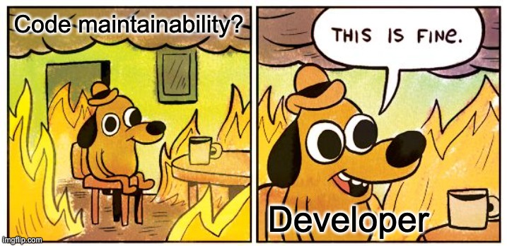
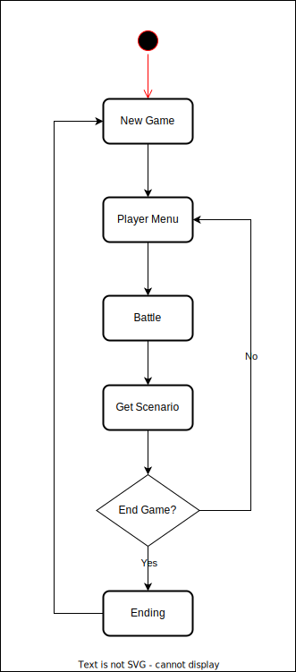
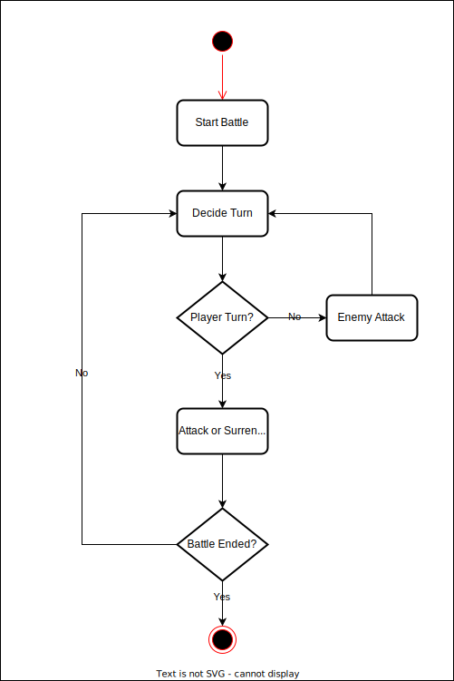

# Hex Monscape 👾

[](https://github.com/Haraj-backend/hex-monscape/actions/workflows/deploy.yml) [](https://opensource.org/licenses/MIT) [](https://goreportcard.com/report/github.com/Haraj-backend/hex-monscape) 

Welcome to this repo!

In this repo you will learn about Haraj Solutions Team's secret technique in writing production-grade code for Haraj projects that help serves millions of users daily in Saudi Arabia. 🥷🏻💥

The secret technique actually lies in the software architecture we choose for these projects: [Hexagonal Architecture](./docs/reference/hex-architecture.md).

Since this repo is intended as get started guidelines for everyone who wants to know how we write production-grade code for Haraj projects, we will try our best to explain everything about this technique in simple & fun ways. 

In order to do that, we will be using simple server-client game named `Hex Monscape`. We are using [Hexagonal Architecture](./docs/reference/hex-architecture.md) to structure the game server code while implementing it using [Go](https://go.dev/). For the web client we implement it using [Vue 3](https://vuejs.org/).

To understand how we apply [Hexagonal Architecture](./docs/reference/hex-architecture.md) to this game, please refer to [this doc](./docs/reference/hex-architecture.md).

To start playing the game, please refer to [How to Run The Game](#how-to-run-the-game) section.

> **Note:**
>
> As Solutions Team member, our understanding towards [Hexagonal Architecture](./docs/reference/hex-architecture.md) is necessary since it is the default architecture we used for building Haraj production services.
>
> So if we understand this architecture well, we will be in no time contributing to Haraj production.
>
> Even though in this repo we are using Go to implement [Hexagonal Architecture](./docs/reference/hex-architecture.md), but actually this architecture is language agnostic. So we could apply it to other language as well such as PHP, Typescript, & Python.

## Background Story

One of the biggest engineering issue in Haraj is code maintainability.

What is code maintainability? Essentially it is the ability of a codebase to be easily maintained by other developers. So when a developer no longer able to maintain the codebase, other developers could easily take over the code he/she left behind.

In the early days of Haraj, we used to assign project ownership to a single developer. So every developer in the team will own at least one project. However we made a mistake by not setting up common standards on how to write code in Haraj. So every developers in the team wrote code based on their own style & preference.

Usually our developers will stay for quite a long time (`~5 years`) before they left. So when a developer left the team, usually he/she already owned several projects that valuable for Haraj business. The problem is since the projects written by the developer's own style, no one in the team could easily take over those projects. 😅

<p align="center">
    
</p>

This is why code maintainability grows into such a big issue in Haraj and the solution to prevent more of this is to set up common standards on how to write code in Haraj projects. This is where [Hexagonal Architecture](./docs/reference/hex-architecture.md) comes into play.

## Game Design

In the game you will play as a `10 years` old monster hunter that dreams to become the very best. In order to reach that, you need to make journey together with your monster partner to seek `3` strong wild monsters and kick them in the butt. 💥💪🏻

The game scenario is pretty simple, player just need to choose monster partner then won battle for `3` times to beat the game. After that player may choose to end the game or continue playing.

Here is the flowchart for the game scenario:

<p align="center">
    
</p>

Here is the flowchart for each battle in the game:

<p align="center">
    
</p>

To see the REST API specification for this game, please see [this doc](./docs/api/rest-api.md).

## How to Run The Game

You can try out this game online by visiting this URL: https://hex-monscape.haraj.app.

If you want to run the game locally, make sure following applications already installed in your machine:

- [Docker](https://docs.docker.com/get-docker/) `v20.10.23` or above => this will also install Docker Compose `v2.15.1`
- [make](https://linuxhint.com/make-command-linux/) => to execute the scripts for running the project defined in [Makefile](./Makefile)

After that use this command to run the game:

```bash
> make run
```

Wait for a moment until you see message like this:

```bash
rest-memory-client-1  | yarn run v1.22.19
rest-memory-client-1  | $ vite --host --port 8161
rest-memory-client-1  | 
rest-memory-client-1  |   vite v2.8.4 dev server running at:
rest-memory-client-1  | 
rest-memory-client-1  |   > Local:    http://localhost:8161/
rest-memory-client-1  |   > Network:  http://172.31.0.3:8161/
rest-memory-client-1  | 
rest-memory-client-1  |   ready in 151ms.
```

After that you could access the game by visiting this URL: http://localhost:8161.

## Multiple Server Variants

Actually there are `3` variants of game server in this project:

- Server using In-Memory storage => run command: `make run-rest-memory`
- Server using DynamoDB storage => run command: `make run-rest-dynamodb`
- Server using MySQL storage => run command: `make run-rest-mysql`

All of them serve the same game, the only difference is the place where they store the game data.

For details on these commands, please refer to [this Makefile](./Makefile).

> **Note:**
>
> When we use [Hexagonal Architecture](./docs/reference/hex-architecture.md) to build an application, it is quite easy to swap its infrastructure code with another technologies.
>
> So for example, if initially we used in-memory storage to store our data, we could easily swap it with MySQL storage or something else. This is why in this project we provide `3` variants of game server for you, this is to demonstrate exactly this point.

## Attribution

The monster characters used in this project is designed by [Freepik](http://www.freepik.com). To be exact we are using [this asset](https://www.freepik.com/free-vector/set-funny-monsters-hand-drawn-style_1933029.htm).

The memes used in this project is generated using [this meme generator](https://imgflip.com/memegenerator).

The project layout used in this project is inspired by [this repo](https://github.com/golang-standards/project-layout).

## Contributing

Got more idea on how to make this learning project more fun? Or maybe you found something that can be improved from this project?

Feel free to contribute to this repo by opening issue or creating a pull request! 😃

## Core Maintainers

Got any questions related to this project? Feel free to contact us:

- [Riandy Rahman Nugraha (@riandyrn)](https://github.com/riandyrn)
- [Muhammad Iskandar Dzulqornain (@isdzulqor)](https://github.com/isdzulqor)
- [Muhammad Izzuddin al Fikri (@knightazura)](https://github.com/knightazura)
- [Alfat Saputra Harun (@harunalfat)](https://github.com/harunalfat)
- [Ilham Syahid Syamsudin (@ilhamsyahids)](https://github.com/ilhamsyahids)

We will be very happy to help you! 🚀

## License

MIT