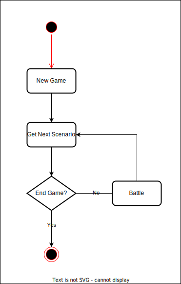

# Hex PokeBattle

Hex PokeBattle is a simple web game implemented using [Hexagonal Architecture](./docs/hex_arch.md).

It is intended to become Solutions Team reference when they want to implement web app using Hexagonal Architecture.

To learn more about API for this game check out [HTTP API](./docs/http_api.md) doc.

To learn the methodology of how to create web app using Hexagonal Architecture, check out [Project Methodology](./docs/project_method.md) doc.

## Game Concept

The game concept is pretty simple, player just need to choose his/her pokemon partner & won battle for 3 times to beat the game.

Here is the flowchart of the game:

<p align="center">
    
</p>

Here is the flowchart for each battle in the game:

<p align="center">
    
</p>

## How to Run

This app is powered by docker. So make sure to install it before running below command:

```bash
> make run
```

Upon success, your console should output message like following:

```bash
2022/02/20 15:53:42 server is listening on :9186...
```

## How to Run (LocalStack)

We will run the app by using LocalStack DynamoDB as a storage.

Necessary environment variables can be configure from [config.yml](cmd/lambda/config.yml)

```bash
> make run-with-ddb
```

Upon success, docker compose should have log like following:

```
hex-pokebattle_1  | 2022/03/16 07:54:21 Running service...
hex-pokebattle_1  | 2022/03/16 07:54:21 Running in server mode at :9186
```

After the message is shown, you could access http://localhost:9186 using your browser to play the game.
