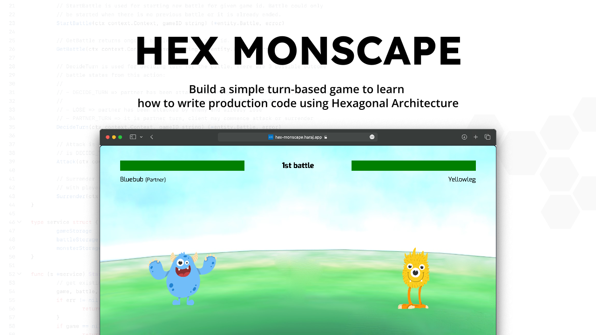

# Hex Monscape 👾

[](https://pkg.go.dev/github.com/Haraj-backend/hex-monscape)
[](https://goreportcard.com/report/github.com/Haraj-backend/hex-monscape)
[](https://coveralls.io/github/Haraj-backend/hex-monscape?branch=master)



`Hex Monscape` is a simple turn-based game for Haraj Solutions Team onboarding process.

Within the game source code, you can find the team's secret technique in writing production code for [Haraj](https://haraj.com.sa) services that help serve millions of people daily in Saudi Arabia despite only having a handful of members. 🥷🏻💥

The secret technique actually lies in the architecture we choose for these services: [Hexagonal Architecture](./docs/reference/hex-architecture.md).

By using this remarkable architecture, not only can we speed up the development process of these projects but also make them maintainable by the whole team.  This is why even though our team is small, we can still create services that help serve millions in Saudi Arabia without sabotaging our good sleep at night. 🤣

This game was created using [Golang](https://go.dev/) & [Vue 3](https://vuejs.org/). Please refer to [this doc](./docs/reference/hex-architecture.md) to learn how we apply [Hexagonal Architecture](./docs/reference/hex-architecture.md) to this game.

To start playing the game, please refer to [How to Run The Game](#how-to-run-the-game) section.

> **Note:**
>
> Many people got interested in software engineering because of games. So using them to exchange knowledge within our team seems like a fun idea. This is why we created this project. 😃
>
> Even though we are using Golang to implement [Hexagonal Architecture](./docs/reference/hex-architecture.md) in this repo, the architecture itself is language agnostic. So we can also apply it to other languages such as PHP, Typescript, & Python. This is why we believe this repo could also be useful for other software developers outside our team. 😁

## Background Story

One of the most significant engineering issues in [Haraj](https://haraj.com.sa) is code maintainability.

What is code maintainability? Essentially it is the ability of a codebase to be easily maintained by others. So when a developer can no longer maintain the codebase, other developers could easily take over the code they left behind.

As you may already know, Haraj engineering team is small. So in our early days, we gave project ownership to the developer who started the project. This developer will be responsible for every aspect of the project development: writing the code, deploying it to production, & maintaining it.

At that time, we did not set common standards for writing code for those projects. So every developer writes code based on their style & preferences with almost no consideration for other developers.

This situation created a lot of stress for each developer on the team. Since they were the only ones who understood the code they wrote, they were the only ones who could maintain it. So when they are on vacation or sick, they must be on standby to fix any issues that might arise in their projects. 😔

On the other hand, our developers will stay long before they leave (`~5 years`). So when a developer leaves the team, they usually own several valuable projects for the Haraj business. The problem is that since the projects were written in the developer's style, no team member could easily take over those projects. 😅

<p align="center">
    
</p>

This is why code maintainability grows into such a big issue in Haraj, and the solution to prevent more of this is to set up common standards on how to write code in Haraj projects. This is where [Hexagonal Architecture](./docs/reference/hex-architecture.md) comes into play.

## Game Design

In the game you will play as a `10 years` old monster hunter that dreams to become the very best. In order to reach that, you need to make journey together with your monster partner to seek `3` strong wild monsters and kick them in the butt. 💥💪🏻

The game scenario is pretty simple, player just need to choose monster partner then won battle for `3` times to beat the game. After that player may choose to end the game or continue playing.

Here is the flowchart for the game scenario:

<p align="center">
    
</p>

Here is the flowchart for each battle in the game:

<p align="center">
    
</p>

To see the REST API specification for this game, please see [this doc](./docs/api/rest-api.md).

## How to Run The Game

You can try out this game online by visiting this URL: https://hex-monscape.haraj.app.

If you want to run the game locally, make sure following applications already installed in your machine:

- [Docker](https://docs.docker.com/get-docker/) `v20.10.23` or above => this will also install Docker Compose `v2.15.1`
- [make](https://linuxhint.com/make-command-linux/) => to execute the scripts for running the project defined in [Makefile](./Makefile)

After that use this command to run the game:

```bash
> make run
```

Wait for a moment until you see message like this:

```bash
rest-memory-client-1  | yarn run v1.22.19
rest-memory-client-1  | $ vite --host --port 8161
rest-memory-client-1  |
rest-memory-client-1  |   vite v2.8.4 dev server running at:
rest-memory-client-1  |
rest-memory-client-1  |   > Local:    http://localhost:8161/
rest-memory-client-1  |   > Network:  http://172.31.0.3:8161/
rest-memory-client-1  |
rest-memory-client-1  |   ready in 151ms.
```

After that you could access the game by visiting this URL: http://localhost:8161.

## Multiple Server Variants

Actually there are `3` variants of game server in this project:

- Server using In-Memory storage => run command: `make run-rest-memory`
- Server using DynamoDB storage => run command: `make run-rest-dynamodb`
- Server using MySQL storage => run command: `make run-rest-mysql`

All of them serve the same game, the only difference is the place where they store the game data.

For details on these commands, please refer to [this Makefile](./Makefile).

> **Note:**
>
> When we use [Hexagonal Architecture](./docs/reference/hex-architecture.md) to build an application, it is quite easy to swap its infrastructure code with another technologies.
>
> So for example, if initially we used in-memory storage to store our data, we could easily swap it with MySQL storage or something else. This is why in this project we provide `3` variants of game server for you, this is to demonstrate exactly this point.

## Attribution

The monster characters used in this project is designed by [Freepik](http://www.freepik.com). To be exact we are using [this asset](https://www.freepik.com/free-vector/set-funny-monsters-hand-drawn-style_1933029.htm).

The memes used in this project is generated using [this meme generator](https://imgflip.com/memegenerator).

The project layout used in this project is inspired by [this repo](https://github.com/golang-standards/project-layout).

The font used in the words `"Hex Monscape"` on the Hex Monscape logo is [Lexend Deca](https://fonts.google.com/specimen/Lexend+Deca?preview.text=HEX%20MONSCAPE&preview.text_type=custom&category=Sans+Serif,Display) from Google Fonts.

## Contributing

Got more idea on how to make this learning project more fun? Or maybe you found something that can be improved from this project?

Feel free to contribute to this repo by opening issue or creating a pull request! 😃

## Core Maintainers

Got any questions related to this project? Feel free to contact us:

- [Riandy Rahman Nugraha (@riandyrn)](https://github.com/riandyrn)
- [Muhammad Iskandar Dzulqornain (@isdzulqor)](https://github.com/isdzulqor)
- [Muhammad Izzuddin al Fikri (@knightazura)](https://github.com/knightazura)
- [Alfat Saputra Harun (@harunalfat)](https://github.com/harunalfat)
- [Ilham Syahid Syamsudin (@ilhamsyahids)](https://github.com/ilhamsyahids)

We will be very happy to help you! 🚀

## License

MIT
