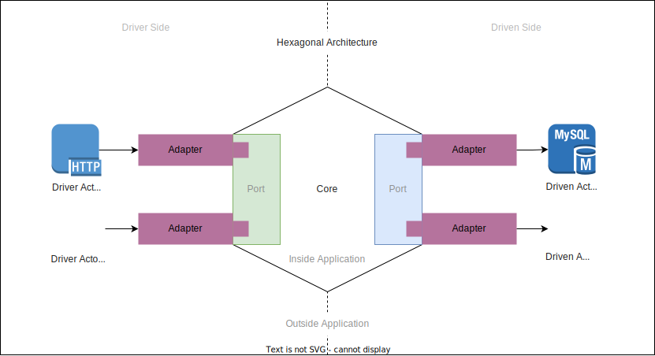

# Hexagonal Architecture

Hexagonal architecture is architectural pattern that put the business logic as centre of everything in application codebase.

There are 3 main principles we need to follow when we want to implement this architecture:

1. Clearly divide between "inside" & "outside" of the application. "Inside" of the application is every components constructing application business logic where "outside" is the otherwise.
2. Dependencies on "inside" & "outside" boundaries should always point towards "inside" components, not the other way around.
3. Isolate boundaries between "inside" & "outside" components using ports & adapters.

From these principles we can infer 4 constructing parts of Hexagonal Architecture:

- [Core](#core) => Our business logic & its dependencies
- [Actors](#actors) => Any entities interacting with our application core
- [Ports](#ports) => Interface that define how actors could interact with application core 
- [Adapters](#adapters) => Responsible for transforming request from actor to core & vice versa. Implement ports.

Understanding these entities is crucial for understanding the implementation of Hexagonal Architecture. Each of them will be explained thoroughly in the upcoming sections.

## Core

[Back to Top](#hexagonal-architecture)

## Actors

[Back to Top](#hexagonal-architecture)

## Ports

[Back to Top](#hexagonal-architecture)

## Adapters

[Back to Top](#hexagonal-architecture)

## DDD Relation

[Back to Top](#hexagonal-architecture)