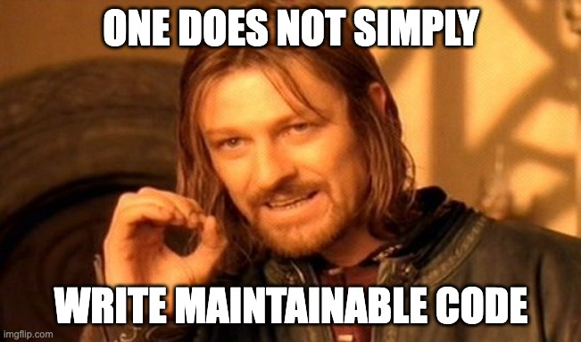
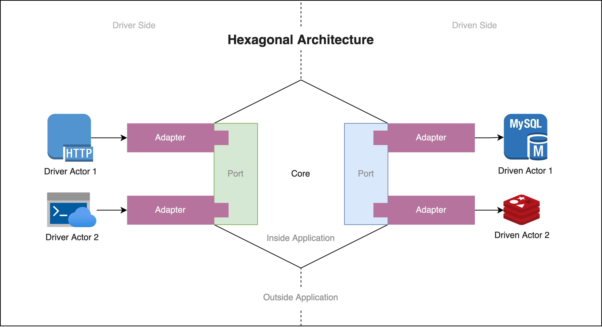
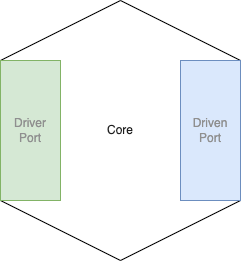
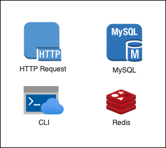
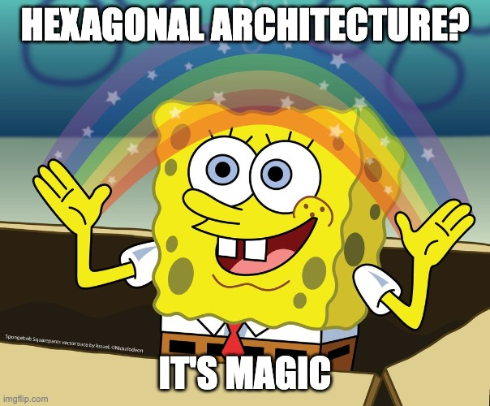

# Hexagonal Architecture

## Background Story

In Solutions Team, we always try to work with small applications. Even in relatively complex systems such as `Haraj Bill` or `Chat Next`, we always try to break them down into much smaller applications depending on the focus of their business use cases.

The reason why we are doing it like this is because small applications will have much less code rather than the big ones. Less code means less complexity in maintaining it. So when the application requires a bug fix or a new feature, it will be much easier to write the necessary changes.

However, since we will have a lot of small applications, we need some standard architecture on how to write them. This is so everyone in the Solutions Team can easily understand them even if they never work with those applications before (a.k.a maintainable code).

    

On top of that, we also need to automate the testing for our code. This is to ensure our changes (especially bug fix) is working as expected and it doesn't break existing application functionalities.

After studying several architectural patterns, we discovered that `Hexagonal Architecture` is the most suitable architecture for our workflow in Solutions Team.

## Why Hexagonal Architecture?

Unlike its sibling architectures (`Clean Architecture` & `Onion Architecture`) which focus on layers, `Hexagonal Architecture` focuses on application business logic. This makes the application created using it very easy to understand, even by someone who just got started in Solutions Team.

When everyone on the team can easily understand our code, they will be able to handle its maintenance. This means when we are getting sick or going on vacation, someone from our team can easily cover our back. This is what it means to have maintainable code.

On top of that, `Hexagonal Architecture` provides an excellent way to write automated tests for our code. This is because it clearly separates the business logic from its dependencies. So we can easily mock the dependencies when writing the tests.

    

However the concrete implementation of `Hexagonal Architecture` could vary between team to team.

This is because `Hexagonal Architecture` is more like a set of fundamental principles rather than a complete recipe. This is why when we read online articles about its concrete implementation, the authors usually come up with their own ways to implement it.

This is also the reason why we suggest you to use this document as your primary reference when learning about `Hexagonal Architecture`. Yeah, this is because when you search for it online, everyone has their own ways to implement it including the Solutions Team.

In the upcoming sections, we will discuss the details of `Hexagonal Architecture` implementation that suitable for Solutions Team projects. To make it easy to understand, we will use `Hex Monscape` as our implementation example.

## What is Hexagonal Architecture?

    

`Hexagonal Architecture` is an architectural pattern that puts the business logic at the center of everything in the application codebase.

There are `3` main principles we need to follow when we want to implement this architecture:

1. Clearly divide between the `inside` & `outside` of the application. `Inside` of the application is every components constructing application business logic where `outside` is the otherwise.
2. Dependencies on `inside` & `outside` boundaries should always point towards `inside` components. So `outside` components must always refer to `inside` components, not the other way around.
3. Isolate boundaries between `inside` & `outside` components using ports & adapters.

From these principles, we can infer `4` constructing pillars of `Hexagonal Architecture`:

- [Core](#core) => A group of components constructing our application business logic. This is the `inside` of our application.
- [Actors](#actors) => Any external entities interacting with our application.
- [Ports](#ports) => Interfaces that specify how [Actors](#actors) can interact with [Core](#core). This is the boundary between the `inside` & `outside` of our application.
- [Adapters](#adapters) => Implement specification provided by [Ports](#ports) so [Actors](#actors) can interact with [Core](#core) and vice versa.

Each of these pillars will be explained thoroughly in the upcoming sections.

## Core

`Core` is a group of components constructing our application business logic. Essentially it governs how our application should behave on expected use cases (hence named `Core`).

    

In Solutions Team, we use the following method to spot out `Core` components:

1. Take a look at our application API specification. Try to spot out the business logic context from there.
2. In `Hex Monscape`, when we take a look at its [API specification](../api/rest-api.md), we can see there are `2` context of business logic:
    - `Play context` => This is where the player starting new game and progressing the game itself.
    - `Battle context` => This is where the player battle enemy with his/her monster partner.
3. For each of these context, define `Service` interface for it. Just like what we did in [here](../../internal/core/service/battle/service.go#L20-L44) & [here](../../internal/core/service/play/service.go#L18-L29). Remember to also write the expected behavior for each methods as comments like in [here](../../internal/core/service/play/service.go#L22-L23). Trust me these comments will greatly help keeping our head in straight line when implementing these methods.
4. Notice that the `Service` interface that we define in step `3` is only the `Driver Port` for our application, not our `Core` component. However it is good starting point for us to define our `Core` component.
5. Implement the `Service` interface just like what we did in [here](../../internal/core/service/battle/service.go#L46-L195) & [here](../../internal/core/service/play/service.go#L31-L81). Notice that this is the place where we put our application business logic. This is also our very first `Core` component.
6. During the implementation of `Service` interface, we will notice that we need to interact with external entities such as `MySQL` database. This is where we need to define `Driven Port` interfaces for our application just like what we did in [here](../../internal/core/service/battle/storage.go) & [here](../../internal/core/service/play/storage.go).
7. Beside defining `Driven Port` interfaces, during the implementation of `Service` interface we will also need to define data model for supporting our business logic. This is why we have `Entity` package in [here](../../internal/core/entity/).
8. There you have it, we have all `Core` components for our application!

> **Note:**
>
> Sometimes we face confusion when we are in step `5`, `6`, & `7`. Usually this is because we find it difficult to find relationship between each `Core` components. In such case, try to utilize class diagram just like what we did in [here](../diagrams/class-diagram.png). This will greatly help us in mapping out the relationship between each `Core` component.

## Actors

Actors are external entities that interact with our application.

    

There are `2` types of actors:

- `Driver Actor` => Actor that initiates interaction with our application.
- `Driven Actor` => Actor that being called by our application as the result of interaction with `Driver Actor`.

In the case of `Hex Monscape`, the incoming HTTP requests are the examples of `Driver Actor` while the `MySQL` database is the example of `Driven Actor`.

## Ports

Ports are interfaces defined inside [Core](#core) that define how [Actors](#actors) can interact with [Core](#core) components & vice versa.

There are `2` types of ports:

- `Driver Port` => Ports for defining interaction between driver actor & core.
- `Driven Port` => Ports for defining interaction between core & driven actors.

In the case of `Hex Monscape`, the examples for `Driver Ports` are [`battle.Service`](../../internal/core/service/battle/service.go#L20-L44) & [`play.Service`](../../internal/core/service/play/service.go#L18-L29).

As for the examples for `Driven Ports` are all interfaces defined in [here](../../internal/core/service/battle/storage.go) & [here](../../internal/core/service/play/storage.go).

## Adapters

Adapters are the components used to translate interaction from [Actors](#actors) to [Core](#core) components & vice versa. They implements [Ports](#ports) defined in the [Core](#core).

There are `2` types of adapters:

- `Driver Adapter` => Adapter for translating interaction from the `Driver Actor` into a call acceptable by application core.
- `Driven Adapter` => Adapter for translating the command given by application core to `Driven Actor`.

In the case of `Hex Monscape`, the example for `Driver Adapters` is [`rest.API`](../../internal/driver/rest/api.go).

As for the examples for `Driven Adapters` are [`battlestrg.Storage`](../../internal/driven/storage/memory/battlestrg/storage.go), [`gamestrg.Storage`](../../internal/driven/storage/memory/gamestrg/storage.go), & [`monstrg.Storage`](../../internal/driven/storage/memory/monstrg/storage.go).

## Conclusion

Creating an application with `Hexagonal Architecture` is very simple.

We just need to think about the expected behavior of our application, create the `Core` components for it, then define the necessary `Ports` & `Adapters` for our `Core` components. Voila, we have our application ready! 😁

Understanding applications created using `Hexagonal Architecture` is also straightforward.

We just need to learn about its `Core` components, understand its business context, and suddenly understand the whole application context! 😁

This is why in Solutions Team we choose `Hexagonal Architecture` as our default architecture when building our applications. Yeah, because it enables us to create maintainable code much more quickly! 😁

    

To learn how to apply `Hexagonal Architecture` in the new Solutions Team project, please refer to [Project Methodology](./project-methodology.md) document.

## Extra: Relation with DDD

`Domain-Driven Design` (`DDD`) & `Hexagonal Architecture` are commonly paired. Some people even used the terms interchangeably.

In reality, `DDD` & `Hexagonal Architecture` are separate things. `DDD` is an approach to spot application logic components from a business model perspective, while `Hexagonal Architecture` gives our application a structure.

`DDD` basically provides a formalized way to define the application core for `Hexagonal Architecture`. But it is not a must for us to use `DDD` when implementing `Hexagonal Architecture`.

`DDD` & `Hexagonal Architecture` is a good combination to create large applications with complex business logic. But for us who want to create small applications with simple business logic, `DDD` might be an overkill.

## References

- https://alistair.cockburn.us/hexagonal-architecture/
- https://blog.octo.com/en/hexagonal-architecture-three-principles-and-an-implementation-example/
- https://www.youtube.com/watch?v=oL6JBUk6tj0
- https://medium.com/@matiasvarela/hexagonal-architecture-in-go-cfd4e436faa3
- https://medium.com/ssense-tech/hexagonal-architecture-there-are-always-two-sides-to-every-story-bc0780ed7d9c
- https://medium.com/ssense-tech/domain-driven-design-everything-you-always-wanted-to-know-about-it-but-were-afraid-to-ask-a85e7b74497a
